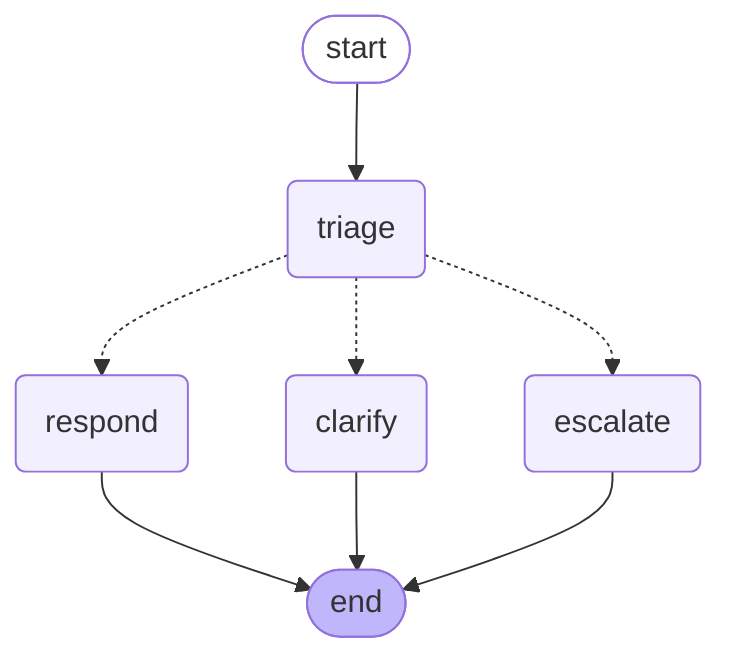

# SFR Triage Agent — Architecture

The plain endpoint answers every ticket it receives. That is the right behaviour
right up until a ticket arrives that should not be answered — one too vague to
reply to without guessing, or one reporting a breach where an automated
acknowledgement reads as negligence.

The agent adds the step the chain cannot take: read the ticket, decide whether it
can be answered at all, and route accordingly.

## Graph

```
START
  │
  ▼
triage ──┬── auto_respond ─────────→ respond   → END
         ├── needs_clarification ──→ clarify   → END
         └── escalate ────────────→ escalate  → END
```



One decision point, three terminal branches, no cycles.

## Nodes

| Node | Reads | Writes | Model calls |
|------|-------|--------|-------------|
| `triage` | ticket content, priority, partner, category | `triage_decision`, `confidence_score`, `triage_reasoning`, `clean_content` | 1 (temperature 0) |
| `respond` | `clean_content`, priority, customer | `response` | 1, via the shared SFR chain |
| `clarify` | `clean_content`, priority, partner | `clarifying_question` | 1 (temperature 0.3) |
| `escalate` | `clean_content`, `triage_reasoning` | `escalation_summary` | 1 (temperature 0.1) |

Two model calls per ticket against the plain endpoint's one. That is the price of
the agent, and it is why both endpoints still exist.

## State

`TriageState` is a `TypedDict`. A node returns only the fields it changed and
LangGraph merges the update, so `respond` can return `{"response": ...}` without
disturbing the triage result.

`node_path` carries an `operator.add` reducer, so each node contributes its own
name and LangGraph concatenates. Without the reducer every node would overwrite
the previous entry and the audit trail would only hold the last node to run.

## Design decisions

### Every triage failure resolves to escalate

Four things can go wrong when reading the model's verdict, and all four land on
`ESCALATE` with confidence `0.0`:

| Failure | Example |
|---------|---------|
| No JSON in the reply | `"I am not able to classify this ticket."` |
| JSON that will not parse | `{"decision": "auto_respond", confidence: bad}` |
| An unknown decision value | `{"decision": "maybe_respond"}` |
| The model call itself raising | provider down after three retries |

The direction matters. A ticket wrongly put in front of a human costs someone a
minute. A wrong automated reply sent to a customer during a security incident
cannot be taken back. Each fallback also records *why* it fired in
`triage_reasoning`, so a defaulted escalation is distinguishable from a real one.

### Triage runs at temperature 0

Not 0.1, not 0.2. A ticket that triages as `escalate` at 09:00 and
`auto_respond` at 09:05 on identical text cannot be regression-tested, and there
is no quality upside to sampling variety in a three-way classification.

### The respond node delegates rather than reimplements

`respond_node` calls `ainvoke_sfr_traced` — the same entry point
`POST /api/v1/generate-response` uses. There is one implementation of "generate a
first response", so a prompt change lands on both paths at once. A test asserts
this delegation specifically, because if it ever stopped the two paths would
drift apart silently.

### Escalate has no failure path of its own

Every failure elsewhere routes *to* escalate, so if the escalate node could fail
the safety net would have a hole in it. When its model call raises, it assembles
a handoff note from state instead — worse than a written summary, but it still
tells a human what arrived and why.

### Normalisation happens inside triage, not before the graph

`preprocess_ticket` is `@traceable`, and a traceable called with no run in
progress becomes its own root trace. Running it inside the first node keeps it a
child span of the agent run rather than an orphan sitting beside it. The result
is stored as `clean_content`; the raw `content` stays in state so the trace
inputs still show the ticket as it actually arrived.

### There is no clarify → re-triage loop

The obvious next feature, and the obvious next way to spend a token budget with
nothing to show for it. It needs a turn counter and an exit condition before it
is safe to add, so the graph is acyclic for now.

## Observability

Each run is one LangSmith trace named `SFR-Agent-<ticket_id>`, with a span per
node, tagged `agent` and `priority:<P1|P2|P3>`:

```
SFR-Agent-TICK-3001            [agent, priority:P1]
├── triage                     ← decision + confidence visible in the span output
│   ├── preprocess-ticket
│   └── RunnableSequence
└── respond
    └── SFR-TICK-3001          ← the shared chain, nested
        └── RunnableSequence
```

The branch taken is visible in the trace tree and again in `node_path` on the API
response, so the routing can be audited without opening LangSmith.

## Running it

```bash
curl -X POST localhost:8000/api/v1/generate-response/agent \
  -H 'Content-Type: application/json' \
  -d '{
        "ticket_id": "TICK-3001",
        "content": "AS2 messages failing since 09:15. Partner reports MDN timeouts.",
        "priority": "P1",
        "partner": "Northwind Logistics",
        "category": "AS2"
      }'
```

`partner` and `category` are optional — the agent falls back to `unknown` and
`unclassified` — but triage routes better with them. A P1 in `security` is a
different decision from a P1 in `documentation`.

Exactly one of `first_response`, `clarifying_question`, and `escalation_summary`
is populated on any given call, determined by `decision`. They are separate
fields because a caller has to treat them differently: one goes to the customer,
one goes back asking for detail, one goes to a human queue.

## A note on the fake provider

With `LLM_PROVIDER=fake`, triage returns one canned `auto_respond` verdict, so a
fake run only ever demonstrates the respond branch. That is deliberate — a fake
run has to be reproducible. Routing across all three branches is covered in
`tests/test_agent.py`, which stubs the model per branch.
